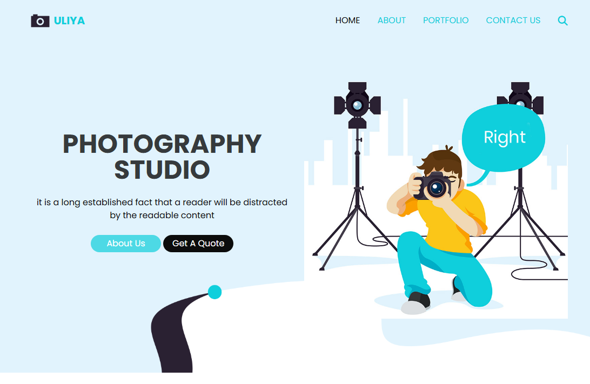
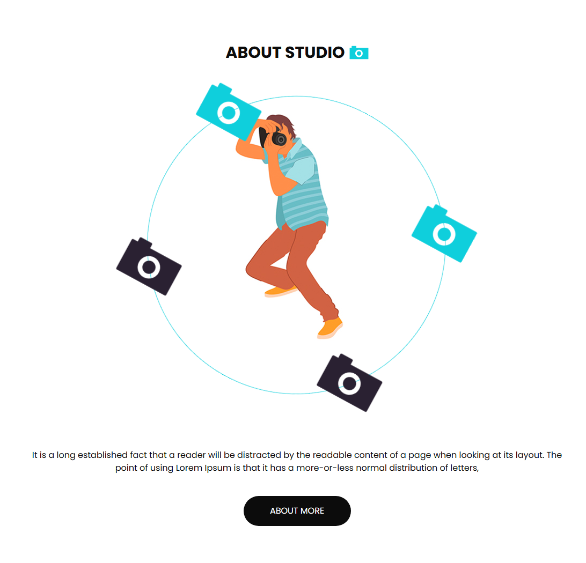
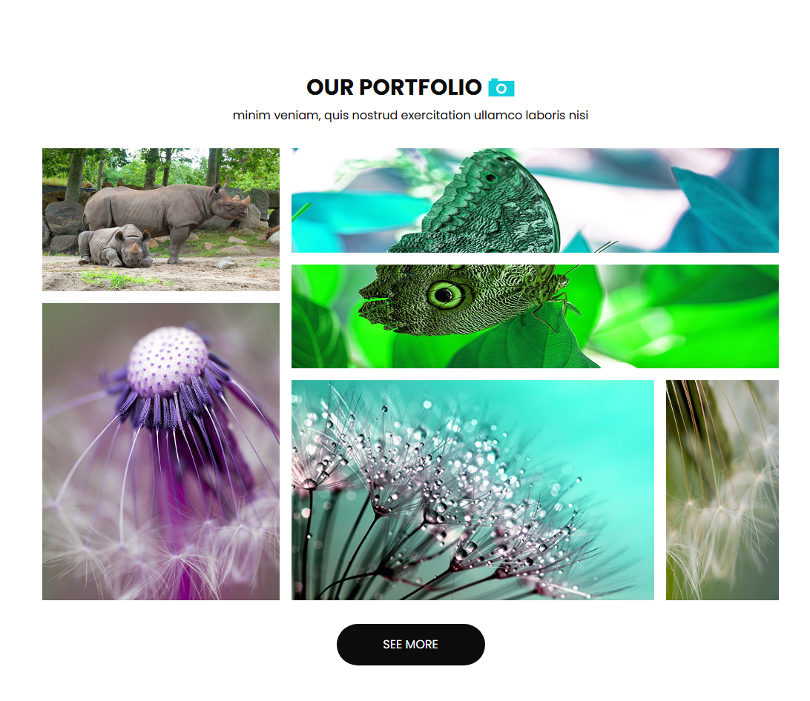
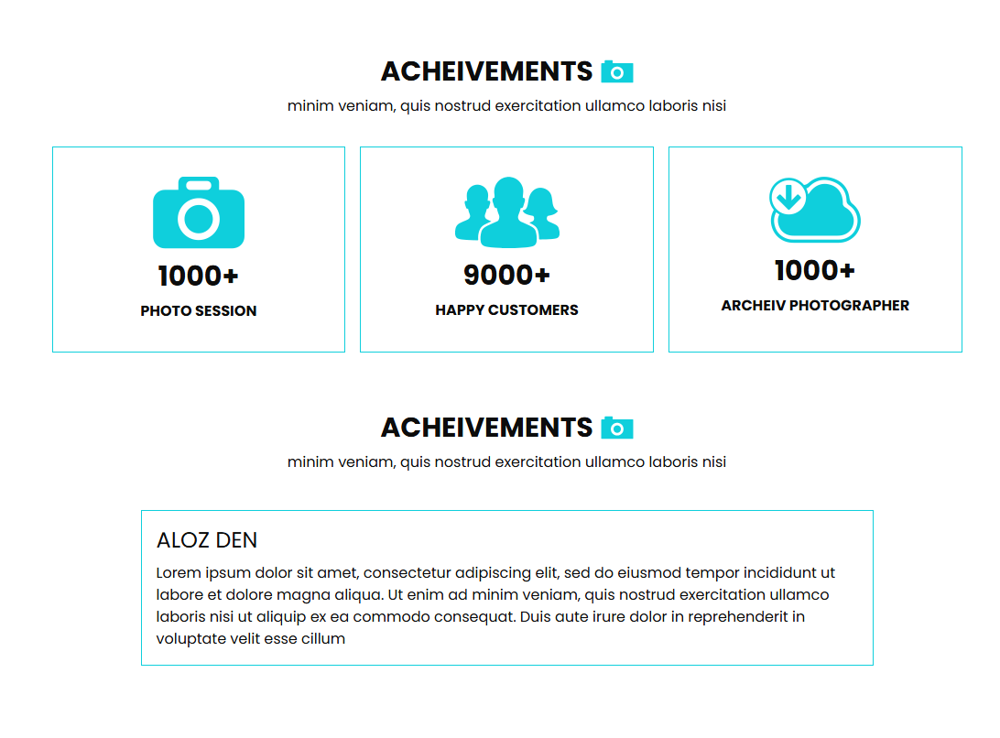

# ULIYA Photography Studio Template

## What technology is used here?

I used Html, css "Tailwind" and Javascript.

## Template Review

### Landing Section

### About us

### Portfolio Section

### Acheivements Section

### Contact us Section

### Footer

## Links

- Facebook
  https://www.facebook.com/profile.php?id=100085749470017

- X
  https://twitter.com/ahmed_magdy135
